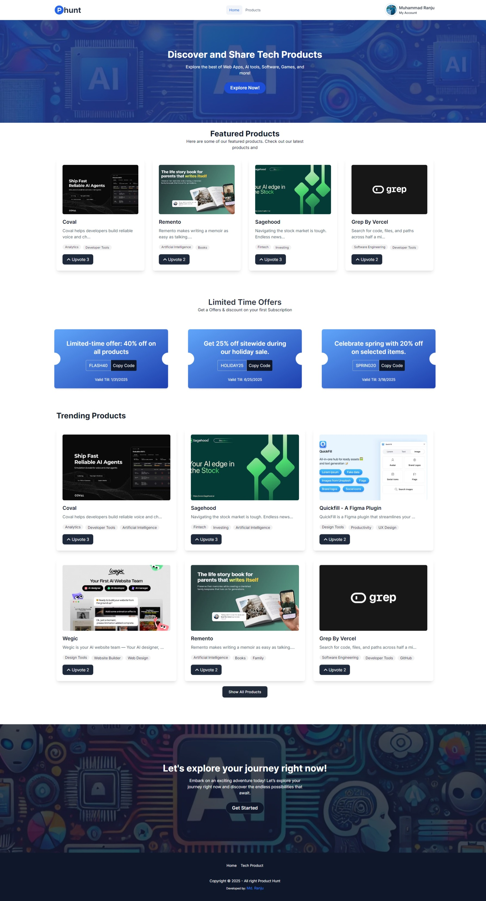
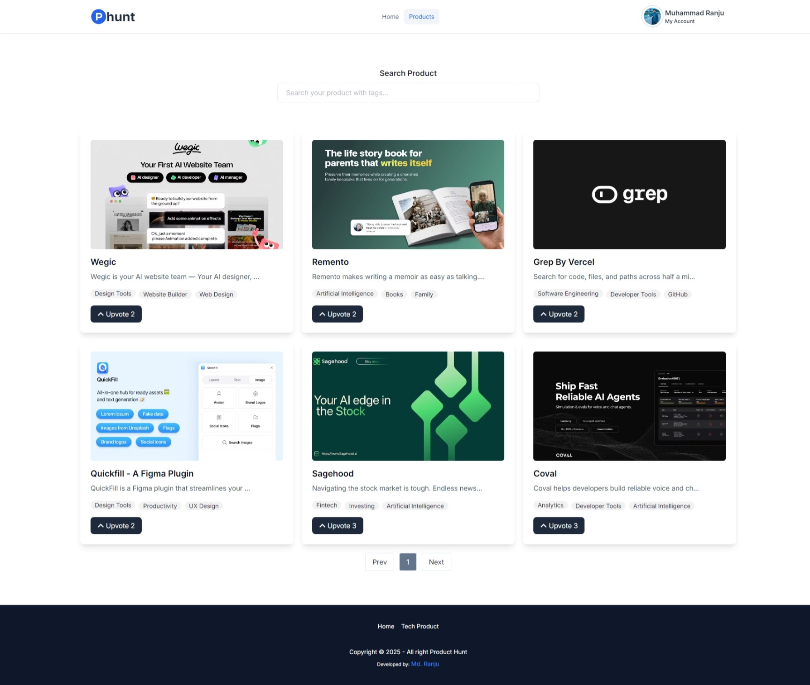
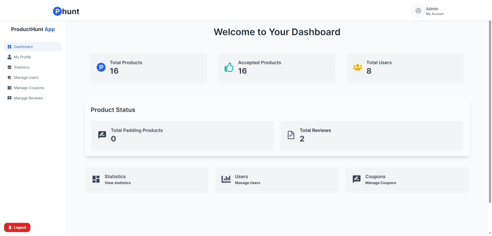
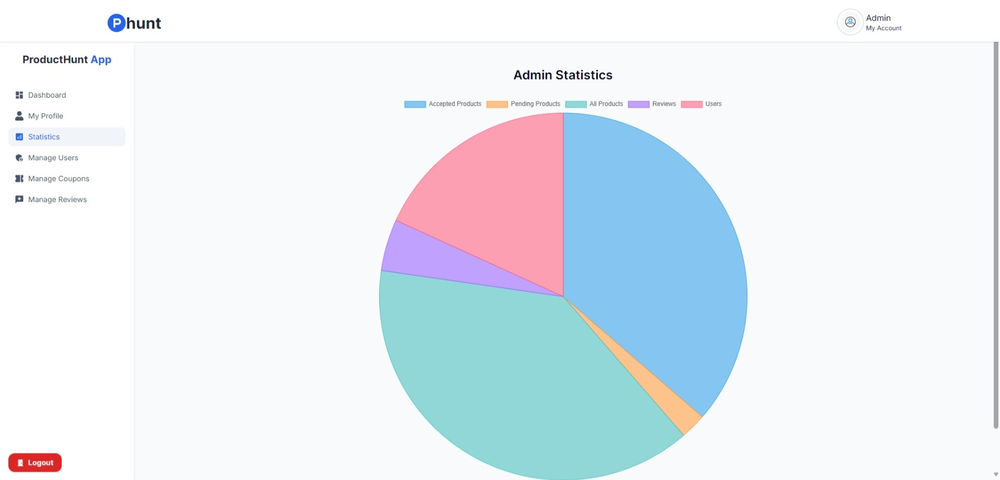

## Project Name: Product Hunt Frontend

### Category: Assignment Category - 15

### Admin Information:

- Name: Admin
- Email: admin@gmail.com
- Password: Admin123

## Website Links:

- Frontend: https://product-huntapp.web.app
- Backend: https://product-hunt-backend.vercel.app

## Description

This project is a frontend application for a Product Hunt clone. It allows users to discover, share, and interact with new products. The application is built with modern web technologies to ensure a smooth and responsive user experience.

## Features

- User authentication and authorization
- Product listing and details view
- Upvoting and commenting on products
- Search functionality
- Responsive design for mobile and desktop
- Admin can see all user and make them as Admin Moderator
- Admin can create coupons
- Admin can delete coupons
- Admin can update coupons

## Technologies:

- React
- React Router
- Axios
- Tailwind CSS

## Purpose:

- This project is a frontend application for a Product Hunt. It allows users to discover, share, and interact with new products. The application is built with modern web technologies to ensure a smooth and responsive user experience.

## Packages Used

- **React**: A JavaScript library for building user interfaces
- **React Router**: Declarative routing for React applications
- **Axios**: Promise-based HTTP client for the browser and Node.js
- **Tailwind CSS**: Visual primitives for the component age

## Screenshots:

